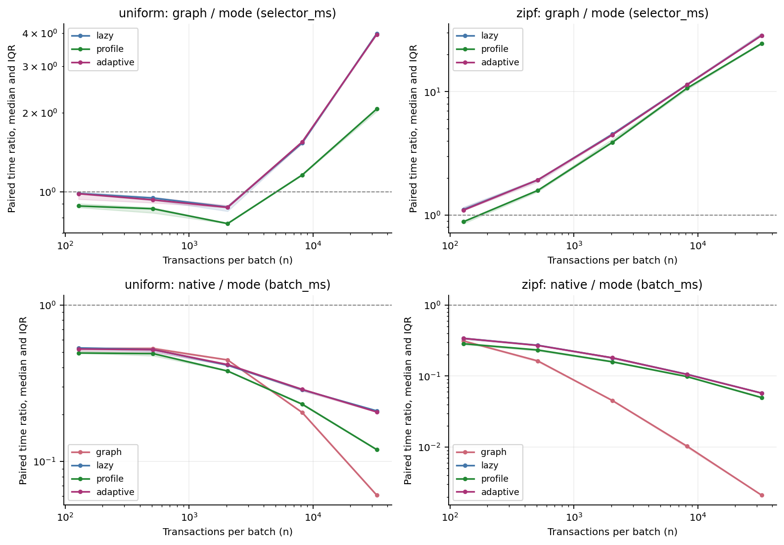
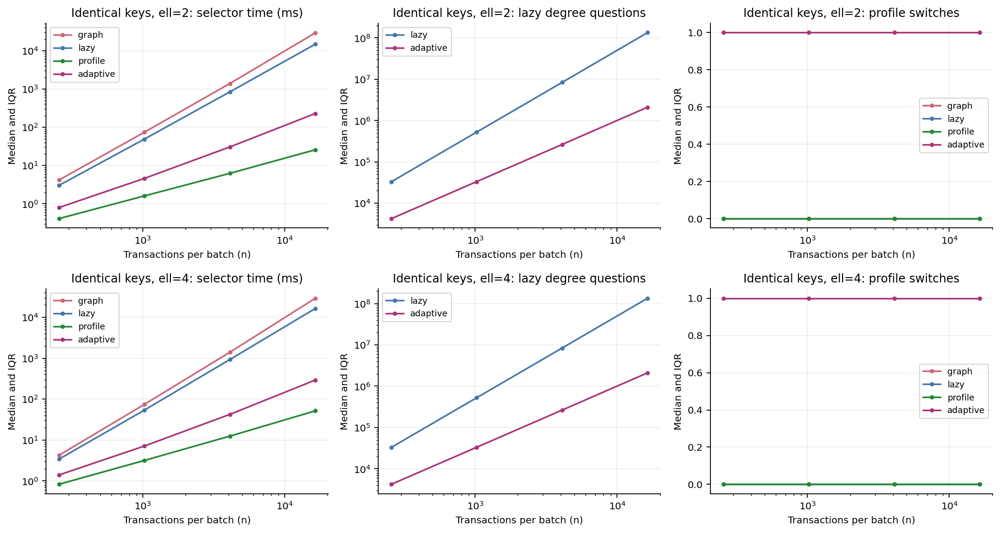
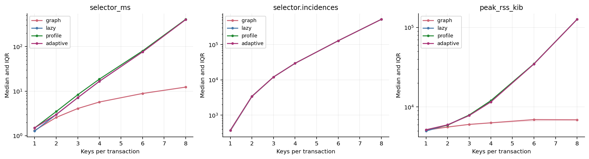
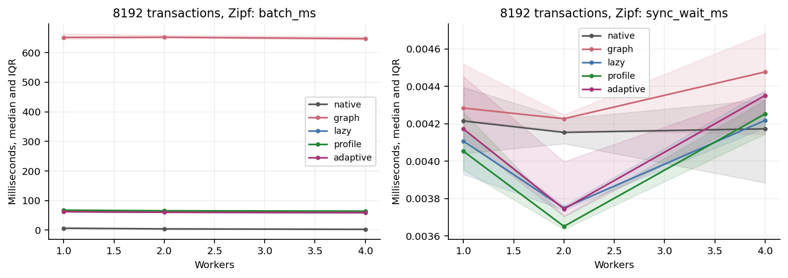

# Exact Abort Selection の Aria 統合・検証報告

対象 Issue: [wasanemon/exact_abort_selection #1](https://github.com/wasanemon/exact_abort_selection/issues/1)

測定日: 2026-09-05

ベース: `d0508c393ec084582c12e6f3abadab63501eaedd`

性能測定用コード: `f202a4e36165658415768ee7257cba876ca68098`

## 結論

完全 RMW に固定した EAS policy の全中止列は、graph・lazy・profile・adaptiveで一致した。
固定 arity の全選択上限に対応する profile と adaptive を実装でき、単なる lazy heap の
実装を劣二次時間の保証と取り違えていない。

主系列の Zipf 0.99、n=32768、2キー、k=2 では、adaptive の selector は明示 bitset graph
に対して paired 中央値 **28.45倍**速かった。しかし同条件のバッチ全体は native Aria
の約 **17.4倍の時間**を要した。主系列の EAS 200測定で native よりバッチ時間が短いものは
なかった。このグラフ比較の倍率を「Aria の高速化」と解釈することはできない。

主系列の adaptive は50測定すべてで切替え0回だった。ここでの改善は lazy 経路による。
profile の最悪計算量への備えには別の価値と定数費用があり、全員競合する入力で実切替えと
lazy 単独の二次的な再評価増加を確認した。小さい一様バッチでは graph の方が速く、
EAS の確定件数も native より常に多いわけではない。k=2 にはゼロ commit の反例が残る。

## 実装と比較対象

専用 `bench_eas` は、元の `AriaManager`、`AriaExecutor::read_snapshot()`、二段階の
transaction実行、private write set、`aria::Table`、`Aria::commit()` を使う。
READ 終了の barrier 後、COMMIT 開始前に manager が実際の R/W set から論理キーを抽出し、
一バッチにつき一度だけ selector を実行する。decision 配列を公開して元の worker が
確定書込みを適用する。次の READ は全書込み完了後である。

元 Aria 側の変更は Context の既定 nullptr hook、manager の3箇所のcallback、executor の
任意計測とdecision経路に限定した。元の Aria.h、AriaTransaction.h、reservation/dependency
判定本体、YCSBの10キー実装、他protocolは保持した。`ARIA_BUILD_EAS` は既定 OFF。
耐久性、WAL、fsync、回復、複製、分散機能、新たな再試行・公平性制御は実装していない。

|モード|policyと役割|
|---|---|
|native|元 Aria の reservation と RAW/WAR/WAW 判定。snapshot isolation=false、reordering=true|
|graph|同じ EAS policy の bitset グラフ。生存隣接頂点の次数を増分更新し、ordered setで順位を維持|
|lazy|subset 包除による正確な次数と上界 heap。単独の最悪再評価数は二次になり得る|
|profile|最初から heavy singleton profile を構築し、light posting と heavy→profile 接続を更新|
|adaptive|lazyから開始し、既定の質問予算後のround終了・全削除・trim後に一度だけprofileへ切替え。ell=1はprofile始動|

これは native Aria の中止判定を同じ結果のまま高速化する置換ではない。
ID1=`{a,b}`、ID2=`{a,c}`、ID3=`{b,d}`、k=1 の実エンジン検査では、nativeはID1を、
EASはID2/3を確定した。EAS同士ではround境界を含む中止列、commit mask、ID昇順証明書の
完全一致を要求し、nativeとの確定集合の一致は要求していない。

詳細は [設計](docs/eas_design.md)、[理論](docs/eas_theory.md)、
[再現README](README_eas.md) を参照。

## 正しさの検査

|検査|実施数と結果|
|---|---|
|selector入力生成|10,103バッチ。全列挙9,050、固定seed random 1,024、個別ケース29|
|独立oracle|40,412実行。全相手の素朴な集合交差と各roundの全再計算|
|最適化selectorとの比較|323,296比較、すべて一致。毎roundの独立degree auditは696,640回|
|Bと切替え|B=1/2/既定、予算=0/1/既定を比較。テスト中26,879回の実切替えを観測|
|不正入力と容量|35件の明示拒否。大きい論理キー、重複ID、非対称R/W、remote/range、arity/incidence/graph上限等|
|実Aria統合|161呼出、181要求バッチ（拒否ケースを含む）、246 assertionで成功|
|並列・連続batch|worker=1/2/4、同じtraceの全decisionと全DB状態を比較。実managerの3epochを連続実行|
|ASan/UBSan|selector全比較と統合試験を実行して成功、stderr空|
|TSan|統合試験を実行して成功、stderr空|
|HSC有限検査|8,615入力を全列挙。前処理NO 4,581、構成4,034、全有向頂点対1,078,892を検査して成功|
|実験ツール|固定trace、paired比、round境界差、timeout、別プロセス等の6検査が成功|

selectorは ell=1〜4、空バッチ/空集合/n=1、同一署名多数、全員同じキー、全員非競合、複数成分、
同点、重複操作を含む。k=1/2/3 と k>n を調べ、追加のarity 6/8も検査した。
`selected` と `alive` を区別し、ID1〜4が `{a}`、ID5〜7が `{b}` の最初の frozen top-2 が
`[4,3]` であることを検査した。逐次削除の `[4,7]` に置換していない。

実エンジンは**各測定の計時後**に、全取引のsnapshot読取り、ID依存の非自明な計算、
private writes、確定集合の独立逐次再実行、キー領域全体の全4laneの最終値を直接比較する。
hash一致だけで済ませていない。read/writeのキーは別アドレスで保持し、同値性は
`(table, partition, uint64_t論理値)` で決める。性能実験の大きいimplicit入力で、検査用の
巨大グラフを裏で作ってはいない。

監査では二つの検査穴を測定前に訂正した。

1. 手作り Batch が未使用のdense key IDを宣言でき、状態配列の空間を A から切り離せた。
   実アクセス数とdense IDの全使用を検査し、確保前に拒否するよう修正した。
2. 実入力と予定traceを別々にdense化して比較すると、単一 `{0}` と `{1}` がどちらも
   `[[0]]` になった。元の論理キーを直接比較する検査へ修正し、回帰テストを追加した。

最小反例・修正前後の結果は [validation](experiments/eas/validation/) に保存した。
有効な入力の EAS policy に対して、oracle と最適化方式の不一致は見つからなかった。
LeakSanitizerは ptrace環境制約によって終了時に失敗した原ログを残し、
`detect_leaks=0` でASan/UBSanを通した。リーク検査の成功は主張しない。

## 実験条件と時間の読み方

事前設定は [plan.json](experiments/eas/plan.json)。入力seedは11/29/47/71/101の5つ、
各条件・各方式につき5測定。同じseedの同一traceを全方式へ渡し、方式順は固定乱数で
入れ替えた。seed=7の別プロセスwarmupを測定と分離し、高負荷な方式を同時実行していない。
5seedのばらつきには入力の違いと実行時間の変動の両方が含まれる。

マシンは Intel Xeon Gold 5418N、96論理CPU、メモリ約247GiB、Ubuntu/Linux
5.15.0-186-generic、GCC 11.4.0、CMake 3.22.1、Python 3.10.12。
プロセス affinity はCPU `0,2,4,6,8`。これは排他的なマシン占有や各threadの固定割当を
保証する設定ではない。workerは1、scale系列で2/4。管理threadと直列selectorも同じ
CPU範囲を使う。compiler flagsは `-pthread ... -O2 -O3 -DNDEBUG -std=gnu++14` で、
Release設定により最後の **-O3** が有効。同じbinaryを全方式で使った。

一プロセス120秒、仮想アドレス空間上限2048MiB（RLIMIT_AS）、runner全体14400秒。
selector上限はarity8、subset incidence 8,000,000、graph bitset 512MiB。
生成・DB初期化・検証を除いた一バッチ一回試行で、abortの再試行は含めない。
値は32byte、全read値・固定ID・キーからwriteを計算する本体を全方式で共用した。

- **selector_ms**: 実R/W抽出・正規化から、構築、trim、全選択、切替え、証明書、
  decisionのコピーと入力buffer解放まで。selector単体でも正規化を含む。
- **batch_ms**: 既存Ariaのsnapshot開始前から全書込み終了barrierまで。
  reservation・選択・書込み・同期待ちを含む。nativeの検証用抽出は時間外である。
- `reservation_worker_ms`、`apply_worker_ms`等はworkerの累積時間で、wall時間の内訳へ
  二重加算しない。EAS側にも残した未使用reservationの費用を保存した。
- `sync_wait_ms`はread/commit phase wallから最長worker処理を引いた残差であり、
  全workerの待機時間の総和ではない。selectorは別の直列区間である。
- RSSは各回別プロセスの全体高水位。DB・入力・検証を含み、selectorだけのメモリではない。
  `/usr/bin/time` の `runner_peak_rss_kib` も記録した。payload推定値は完全なallocator計測ではない。

中央値・min/max・四分位範囲（IQR）をCSVに保存した。paired倍率はseedごとの
`baseline_time / mode_time`を先に計算したうえで集計する。別々の中央値の商ではない。
倍率>1なら分母の方式が速い。timeout等を有限の実測時間へ置換しない。

## 主系列: 同じpolicyの高速化とnative比較

2キー、キー領域10,000、worker=1、k=2。下の時間は5seedの中央値、倍率はpaired中央値。
全方式・全内訳とIQRは [metrics.csv](experiments/eas/results/full/summary/metrics.csv) と
[再生成可能な日本語表](experiments/eas/results/full/summary/tables_ja.md) にある。

|分布|n|native batch ms|adaptive batch ms|graph/adaptive selector倍率|native/adaptive batch倍率|
|---|---:|---:|---:|---:|---:|
|一様|128|0.1602|0.3092|0.985|0.523|
|一様|512|0.6223|1.2069|0.933|0.518|
|一様|2048|2.3401|5.6461|0.874|0.416|
|一様|8192|8.3943|29.1639|1.547|0.289|
|一様|32768|30.8458|148.6494|3.960|0.207|
|Zipf 0.99|128|0.1332|0.3955|1.097|0.339|
|Zipf 0.99|512|0.4700|1.7453|1.934|0.269|
|Zipf 0.99|2048|1.7152|9.4806|4.472|0.181|
|Zipf 0.99|8192|6.6533|62.4696|11.358|0.105|
|Zipf 0.99|32768|26.6436|463.0954|28.454|0.0575|

adaptiveはgraphより7/10条件で速く、一様n=128/512/2048では遅かった。
各条件で5seedすべての勝敗が同じであった。graphの固定費用・密なグラフでの更新費用と、
subset索引・heapの固定費用が違うため、少数キーだから常にimplicit方式が速いとはいえない。
測定したgraphは増分次数更新を持つbitset方式の一実装であり、最速の既知実装とは呼ばない。

profileは主系列の全10条件でlazyよりselector中央値が大きかった。adaptiveの50測定は
切替え0回なので、その主系列の速度をprofileの成果として説明しない。

確定件数もpolicyの相違である。Zipf n=32768の中央値はnative711件、EAS2116件だったが、
バッチ時間も大きく増えた。一様n=128のpairedな `EAS−native` の中央値は0、範囲は−2〜0。
一様n=512は中央値2、範囲−1〜3だった。最大のcommit集合を求めるアルゴリズムではなく、
中止率改善の一律の保証もない。個別方式のcommit中央値の差とpaired差は区別する。



## 最悪入力・実切替え・ゼロcommit

全員が同じ2または4キーを触るk=1系列では、すべての方式がID1のみを確定した。
lazyの次数質問は実測で `n(n+1)/2−1` と一致し、nを4倍にすると約16倍になる。
adaptiveは全40測定で、削除とtrimを終えたround境界で一度だけ切り替えた。

|n|lazy質問数|adaptive質問数|切替えround|切替え時残存数|
|---|---:|---:|---:|---:|
|256|32,895|4,216|17|239|
|1024|524,799|33,264|33|991|
|4096|8,390,655|264,160|65|4,031|
|16384|134,225,919|2,105,280|129|16,255|

n=16384でのselector時間の中央値は次のとおり。

|arity|graph ms|lazy ms|profile ms|adaptive ms|
|---|---:|---:|---:|---:|
|2|29,055.106|14,727.061|25.772|228.192|
|4|29,101.337|16,376.858|51.584|291.739|

この入力では最初からprofileを使う方がadaptiveより速い。2キーのpairedな
`adaptive/profile`時間比は8.863、4キーは5.657であり、切替え前のlazyの仕事には費用がある。
一方、2キーのlazy/adaptive比は64.535で、adaptiveは二次的な再評価の継続を止めた。
この測定は特定入力の挙動確認であり、漸近上限の証明そのものは理論文書のループの計数による。

同じキーの2取引・k=2では、全5seedでnativeは1件、EAS4方式は0件確定した。
EASの中止roundは `[2,1]`。最低1件を確定させる補正を入れていない。
このpolicyの進行性・再試行の成功は保証できない。



## arityの定数費用と適用範囲

selector単体・n=2048・一様分布では、arityが増えるとsubset数の定数費用が明確に現れた。
下のRSSは外部timeが測った全プロセスの中央値で、selectorだけの確保量ではない。

|arity|構築incidence数|graph ms|adaptive ms|adaptive RSS MiB|
|---|---:|---:|---:|---:|
|1|374|1.317|1.506|5.539|
|2|3,426|2.585|3.001|5.828|
|3|12,082|4.093|7.171|7.633|
|4|29,580|5.720|16.658|11.293|
|6|128,961|8.888|75.737|33.914|
|8|522,240|12.344|401.797|123.445|

incidence数は初期孤立取引を除いて実際に構築した値である。graphはsubset indexを作らない。
arity8のadaptiveはgraphよりpairedで32.531倍遅かった。graphの同条件の全プロセスRSSは
6.738MiBである。一般の固定arityの式に含まれる定数を無視できない実例であって、
HSC下限の実証ではない。arity8の同じtraceでincidence予算を1にした4方式はすべて
`unsupported`を返した。入力の切捨てや別policyへのfallbackはない。

実Ariaでのarity=1/3/4、n=512/8192の12条件も各5seedで実行した。
一様n=8192では、adaptiveのgraphに対するselector倍率はarity3で1.039、arity4で0.674と
異なった。arity4ではnative batch 10.669ms、graph 74.615ms、adaptive 106.641msだった。
同じ小さい固定arityでも交差点・実用上の損得は同一ではない。

通常入力（main・arity・scale）のadaptive120測定は切替え0回。ただしarity1は仕様どおり
最初からprofileを使う。arity1/Zipf/n=8192のselectorはlazy47.309ms、profile12.430ms、
adaptive12.444msで、ここでの改善は初期profileによる。arity≥2の通常入力ではlazy経路による。



## worker数、直列費用、残したreservation

2キー・n=8192・Zipfの同一traceで、worker=1/2/4を比較した。独立監査でも全方式について
worker間の完全decision配列とtrace bytesが一致した。各プロセス内の全DB状態検査も通っている。

|workers|native batch ms|adaptive batch ms|adaptive selector ms|adaptive READ wall ms|reservation累積 ms|同期残差 ms|
|---|---:|---:|---:|---:|---:|---:|
|1|6.653|62.470|56.351|5.591|1.121|0.00417|
|2|4.387|60.441|56.476|3.716|1.518|0.00375|
|4|2.859|59.167|56.398|2.479|1.724|0.00435|

worker1→4のpairedなbatch速度比はnative2.360、adaptive1.058だった。
READは短縮しても、直列selectorの約56msがほぼ残る。小さく見える同期残差だけを理由に
並列化制約が小さいと解釈してはいけない。workerはselectorを待っており、その直列区間は
selector_msとしてbatchに含まれている。

READ側のreservationを全EAS方式に残した。表の累積値はworker数を増やすと増えており、
workerの累積時間とwall短縮を混同していない。予約除去による別の高速化は試していない。
全統合系列の33条件×5seed×4 EAS方式、計660のpaired観測で、nativeよりbatchが短い
EASは0件だった。これは今回の値サイズ・本体・入力・実装・マシンの結果であり、
任意の本体コストやハードウェアでの優劣の定理ではない。




## 証明として主張できる範囲

完全RMWでは、キーを共有する相手との間に双方向辺があり、prod-degreeは `d(t)^2`。
subset包除で異なる相手を一人ずつ数え、同じ削除前グラフの frozen top-k を選ぶ。
確定集合はキーが互いに素なので、ID昇順の証明書と元workerの並列適用が正当化できる。

正規化された入力で `A=Σ|S_t|` とし、固定ellについてprofile/adaptiveの構築・trim・
全削除・証明書を含む決定的上限は
`O_ell(A+n^(2−1/ell) log(n+1))` 時間、`O_ell(A+n)` 空間である。
ell=1は `O(A+n log(n+1))`、ell=2は `O(A+n^(3/2) log(n+1))`。
実装のsubset/profile辞書は比較木で、raw key/IDの正規化には平均hash仮定が残る。
任意多数の重複raw操作にはそのsort費用が別途かかる。

trimはキー件数と生存IDのXOR、各取引の支持キー数を使う。キーの2→1遷移は一度で、
全期間のtrimキー訪問は実装・検査ともに3A。profileは実在するprofileだけを持ち、
lightは初期posting、heavyは構築済み接続だけを走査する。毎round全件走査を隠していない。
定数には `2^ell` が入り、実装・実測したarityは8までである。

HSCの [Definition 7](https://drops.dagstuhl.de/storage/00lipics/lipics-vol275-approx-random2023/LIPIcs.APPROX-RANDOM.2023.1/LIPIcs.APPROX-RANDOM.2023.1.pdf)
を仮定すると、対数arityまで許す完全RMW入力族で、最初の正確な候補選択にも一般的な
真の劣二次時間アルゴリズムはない。HSCはSETHそのものでも、証明済みの事実でもない。
Issueの `n=6m+2` の構成、前処理、全次数、連結性、top-1/top-2の帰着を文書で検証し、
小入力では空・重複集合を含めて素朴な交差から直接検査した。

この有限検査やベンチマークはHSCを証明しない。中間の全arityを分類したわけではなく、
固定ellの指数が最適とも示していない。ell依存定数を無視して上限式にell=log nを代入しない。
一般の非対称R/W、範囲検索・phantom、分散OLTPへ同じ定理をそのまま適用することもできない。

## 完了状況、成果物、再現

fullは39条件、測定945件とwarmup189件がすべてok、容量probe4件は期待どおりunsupported。
195の測定条件×seed組でEAS4方式が完全一致した。実行時間は792.842秒で、事前の14400秒予算内。
timeout・OOM・予算打切り・未実行反復はなかった。

さらに、測定コードのcommitを新しいローカルcloneへcheckoutし、依存ライブラリを共有する
クリーンなソースからbuildとCTestを実行した。そこでREADMEのsmokeコマンドを再実行し、
100測定・20warmupがすべてok、20のEAS測定組も一致した。fullとsmokeで重なる120実行の
trace bytesと全decisionが一致した（100測定+20warmup）。fullのworker間比較は30組・60比較で
一致。保存したraw/traceのhash検査はfull2276件、smoke240件で一致し、不整合は0だった。

生データ・実行コマンド・環境・statusを残し、成功した設定だけを抽出して結果にしていない。
数千のraw/logファイルはPRのコード差分を閲覧しやすくするため、各datasetの
`raw_data.tar.gz`へ無損失圧縮してGit保存する。ワークスペースには展開済みも残している。
archive内の全ファイルを元ファイルとbyte単位で比較済みで、SHA検査も再実行できる。
さらに別の一時ディレクトリへarchiveを展開し、元の絶対パスを使わずに監査を通した。
そこから再生成した主要CSV5点と日本語表は、保存版とbyte単位で一致した
（[再展開監査](experiments/eas/validation/archive_replay_audit.json)、
[集計の再現確認](experiments/eas/validation/archive_tables_replay.json)）。

|成果物|場所|
|---|---|
|再現手順・依存関係・全CLI|[README_eas.md](README_eas.md)|
|設計 / 証明・限定|[eas_design.md](docs/eas_design.md) / [eas_theory.md](docs/eas_theory.md)|
|事前設定|[plan.json](experiments/eas/plan.json)|
|full生データarchive|[raw_data.tar.gz](experiments/eas/results/full/raw_data.tar.gz)|
|smoke生データarchive|[raw_data.tar.gz](experiments/eas/results/smoke/raw_data.tar.gz)|
|full実行結果 / 環境|[run_summary.json](experiments/eas/results/full/run_summary.json) / [environment.json](experiments/eas/results/full/environment.json)|
|集計・paired比・図表|[summary/](experiments/eas/results/full/summary/)|
|直接一致・整合性監査|[result_audit.json](experiments/eas/validation/result_audit.json)|
|テスト・sanitizer・clone/buildログと反例|[validation/](experiments/eas/validation/)|

代表的な実行コマンドは以下。既存の保存結果を上書きしない出力名を使う。

```bash
cmake -S . -B build -DARIA_BUILD_EAS=ON -DCMAKE_BUILD_TYPE=Release
cmake --build build --target bench_eas eas_selector_test eas_integration_test -j 2
ctest --test-dir build --output-on-failure
python3 tests/test_hsc.py --output /tmp/eas-hsc.json --log /tmp/eas-hsc.log
python3 experiments/eas/run.py --smoke --output experiments/eas/results/reproduce-smoke --cpus 0,2,4,6,8
python3 experiments/eas/run.py --full --output experiments/eas/results/reproduce-full --cpus 0,2,4,6,8 --timeout 120 --memory-mib 2048 --total-seconds 14400
python3 experiments/eas/summarize.py experiments/eas/results/reproduce-full
python3 experiments/eas/report_tables.py experiments/eas/results/reproduce-full
```

指定CPUが存在しない環境では、許可されたCPU範囲へ `--cpus` を変更し、その設定を保存する。
同梱データからの図表再生成は、まずarchiveを展開する。

```bash
tar -xzf experiments/eas/results/full/raw_data.tar.gz -C experiments/eas/results/full
tar -xzf experiments/eas/results/smoke/raw_data.tar.gz -C experiments/eas/results/smoke
python3 experiments/eas/summarize.py experiments/eas/results/full
python3 experiments/eas/report_tables.py experiments/eas/results/full
python3 experiments/eas/audit_results.py experiments/eas/results/full --smoke experiments/eas/results/smoke --output /tmp/eas-result-audit.json
```

Issue #1の対象内で未完了の必須検査・反復はない。LSanの環境上の失敗は原ログとともに区別し、
リーク検査、耐久性、分散機能、再試行の進行性、一般R/Wへの拡張、任意arityでの実装、
最適commit集合、固定arity指数の最適性を成果として主張しない。
