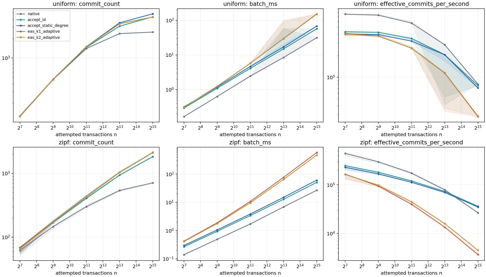
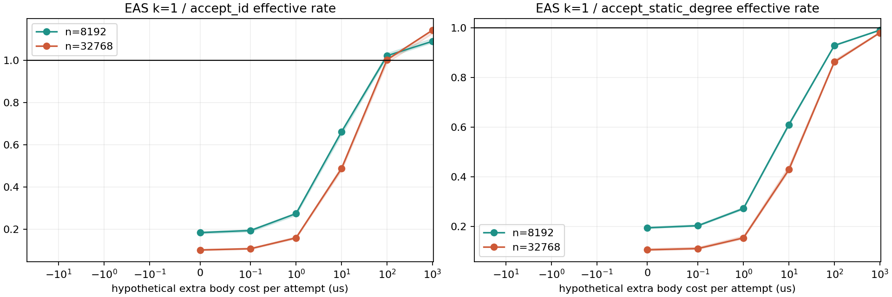

# 安価な採用方式とEASのAria上での比較

対象: [Issue #3](https://github.com/wasanemon/exact_abort_selection/issues/3)
（[保存仕様](docs/issue_3.md)）。測定日: 2026-09-05。
測定commit: `a93af73b8f6ca1a56002ed508cbd40d50519417f`。
EASを含む開始点: `d1de8c4fe3285cc5ed338b760a13be8890007a29`。

## 結論

既存EASの同一判断は保存され、k=1のadaptiveはgraphより代表3条件で約1.55/9.20/45.21倍
速かった。一方、安いpolicyを選べる状況では、この実測からEASを積極的に採用する根拠は弱い。
主比較10条件すべてで、EAS k=1の有効処理率のpaired中央値はaccept_idとnativeより低かった。
staticに対しては一様n=128だけ約2.2%上回ったが、同じ確定件数で約0.0067msという小差である。
この条件でもaccept_idの方が速かった。全条件・全反復の一律敗北とは記述しない。

2キーZipf n=8192/32768では、EAS k=1はstaticに対しpaired中央値で1/8件少なく、
追加batch費用は61.37/513.86ms、有効処理率比は0.194/0.105だった。
一様n=8192/32768では115/519件少なく、費用も大きかった。
件数でaccept_idを上回る条件はあるが、この軽い取引本体では費用増を補えなかった。

有限探索ではEASがstaticより多く確定する例と逆の例を両方確認した。
一部実測seedにもEASの件数利得は残る。均一追加本体費用モデルでは逆転可能な入力があり、
全ての本体費用・retryモデルについてEASが不利とは結論しない。別DBMSへの移植、
重い取引の新実装、retry engine、Issue #4 の作業は行っていない。

## 実装・費用区間

C++に `accept_id` と `accept_static_degree` を追加した。前者はID順で採用済みのキーとだけ
競合検査し、不採用のキーを予約しない。空集合は採用する。初期次数・subset index・profile・
graphは作らず、subset容量上限も課さない。IDが既に昇順なら並べ替えを省く。
共通の論理キー正規化、安全性検査と実R/W抽出は必要な実費として計上した。

staticは異なる競合相手数を一度だけ数え、`(初期次数,ID)` 昇順で採用する。1/2キーでは
singleton/pair計数により、2キー次数は `C(a)+C(b)-C({a,b})-1`。
3/4キーでは一度の包除計数を使う。空集合の次数は0、同一集合の別取引は別人として数え、
自己を除く。計数構造構築・解放、初期次数評価、ソートはselector時間内で、順位更新は行わない。

元のAria本体・既存EAS policyは変更していない。nativeはSI=false/reordering=trueのままで、
全取引のキー別最小writerを確定する。後で中止される取引の予約も残るためaccept_idと違う。
`{a},{a,b},{b,c}` ではnativeがID1だけ、accept_idがID1/3を確定する。
`{a,b},{a,c},{b,d}` ではnative/accept_idがID1、static/EAS k=1がID2/3となる。

全方式が同じ実Aria manager/executor、snapshot、private writes、Table、commitを使う。
32byte値を読んでID・キー・全read値に依存する同じ本体を全試行で実行する。
reservationも全方式に残す。入力生成・DB初期化・検査用開始状態コピー・検証・JSON出力は測定外。
selectorは実R/W抽出開始から正規化・検査・構築・選択・mask/証明書・公開コピーとscratch解放まで。
batchはsnapshot開始直前から全確定書込みと完了handshakeまで。nativeの依存判定はbatch内で、
selectorを呼ばないためselector欄は0。nativeの検証用R/W抽出・正規化は測定外である。
内訳の包含関係は[再現手順](README_policy_comparison.md)に示した。

## 事前計画・環境・集計単位

[plan.json](experiments/policy_comparison/plan.json)を実装前に保存した。
主系列: 2キー、n=128/512/2048/8192/32768、一様/Zipf 0.99、worker=1。
補助: 1/3/4キー、n=8192、両分布。並列: 2キー8192 Zipf、worker=2/4。
k=1 graph/lazy/profile/adaptive対照は8192両分布と同一2キー4096。
mainと対照のadaptive観測を再利用し、重複して独立観測に数えない。

入力seedは11/29/47/71/101、それぞれ時間測定3反復。全1,500性能測定＋100warmupを完遂し、
timeout/OOM/unsupported/未実行は0。各方式は新しいプロセスで実行し、方式順をseed 202609053で
入れ替え、benchmark同士を同時実行していない。seed=7の別プロセスwarmupが次プロセスの
heap/cacheを暖めたとは主張しない。同一4096入力は5seedでも全て同じ競合構造である。

全方式を同じclean checkoutのRelease binaryで再測定した。Intel Xeon Gold 5418N、96論理CPU、
GCC 11.4.0、CMake 3.22.1、Linux 5.15、Python 3.10.12。
affinity集合は0,2,4,6,8。排他的CPU占有やthreadごとの固定割当ではない。
flagsは `-pthread … -O2 -O3 -DNDEBUG -std=gnu++14` で最後の-O3が有効。
binary SHA256は `76d90a2a6af1e9498165dbb57059b0639fcc53ebb97310fac7de051b6ec6b71f`。
[環境](experiments/policy_comparison/results/full/environment.json)と
[clean provenance](experiments/policy_comparison/validation/clean_provenance.json)に保存した。
変更前・開発時の時間は性能比に混ぜていない。

各表の単独値は「seed内3反復の中央値→5seedの中央値」。pairedな差/比は、同じtrace・
同じ反復で計算し、先にseed内、次にseed間で要約する。15回を15独立入力とは数えない。
範囲はseed内要約の5seed間min/max。反復ごとの値とIQRはCSVに全て残した。
別々の中央値の商や差をpaired比較の代用にしない。

## 過去の件数観測の追試

正式fullの102 TSV全てで旧archiveの保存bytesを優先し、既存generatorによる再生成bytes/hashと
一致した。過去Pythonの数値をoracleとして実装調整せず、以下のC++中央値が全項目一致した。

|n|batch_id|native|accept_id|static|EAS k=2|EAS k=1|
|---:|---:|---:|---:|---:|---:|---:|
|8192|1208417051|538|936|1042|1038|1041|
|32768|566257870|711|1829|2125|2116|2119|

これは5seedごとの件数の中央値である。例えばn=32768の中央値同士の差は2119−2125=−6だが、
同一seedのEAS−staticの差を集計した中央値は−8。n=8192のEAS−accept_idも
中央値同士の差105に対してpaired差の中央値は91であり、両者を区別する。

## 主系列の品質・時間・有効処理率

有効処理率は `commit_count / batch_seconds`。一バッチ一回試行の量であり、再試行を含む
定常throughputや公平性ではない。中止件数はn−確定件数で、全raw/CSVにも保存した。

|分布|n|方式|確定件数|selector ms|batch ms|有効処理率 /秒|
|---|---:|---|---:|---:|---:|---:|
|uniform|128|native|126|0.00000|0.16404|761053.4|
|uniform|128|accept_id|126|0.13384|0.29168|431705.0|
|uniform|128|accept_static_degree|126|0.15591|0.31475|400320.3|
|uniform|128|eas_k1_adaptive|126|0.15015|0.30789|409243.7|
|uniform|128|eas_k2_adaptive|124|0.14931|0.30787|402766.1|
|uniform|512|native|462|0.00000|0.62581|737893.8|
|uniform|512|accept_id|465|0.49302|1.08787|422949.8|
|uniform|512|accept_static_degree|466|0.57888|1.17612|394686.8|
|uniform|512|eas_k1_adaptive|466|0.63918|1.23166|377539.6|
|uniform|512|eas_k2_adaptive|464|0.63377|1.23473|374229.8|
|uniform|2048|native|1400|0.00000|2.45119|571150.9|
|uniform|2048|accept_id|1462|1.87026|4.09955|347599.2|
|uniform|2048|accept_static_degree|1496|2.32215|4.66308|319564.0|
|uniform|2048|eas_k1_adaptive|1489|3.56529|5.75425|253956.2|
|uniform|2048|eas_k2_adaptive|1488|3.49526|5.72507|254808.7|
|uniform|8192|native|2381|0.00000|8.42360|283617.5|
|uniform|8192|accept_id|3102|7.21242|14.91139|206218.2|
|uniform|8192|accept_static_degree|3501|9.21587|16.98159|205378.0|
|uniform|8192|eas_k1_adaptive|3385|21.80495|29.61368|114215.8|
|uniform|8192|eas_k2_adaptive|3382|21.56935|29.41548|115517.4|
|uniform|32768|native|2513|0.00000|31.36100|79971.4|
|uniform|32768|accept_id|4330|27.78115|56.74575|76499.1|
|uniform|32768|accept_static_degree|4825|37.83997|68.17902|70740.2|
|uniform|32768|eas_k1_adaptive|4301|121.78175|152.73587|28113.9|
|uniform|32768|eas_k2_adaptive|4298|119.64098|150.25149|28625.7|
|zipf|128|native|62|0.00000|0.13883|445191.2|
|zipf|128|accept_id|67|0.13204|0.26522|248904.6|
|zipf|128|accept_static_degree|69|0.16129|0.29503|230261.7|
|zipf|128|eas_k1_adaptive|69|0.28220|0.42035|166529.5|
|zipf|128|eas_k2_adaptive|66|0.27136|0.40594|163703.1|
|zipf|512|native|147|0.00000|0.48682|298973.6|
|zipf|512|accept_id|170|0.45338|0.93299|182209.7|
|zipf|512|accept_static_degree|176|0.57055|1.04849|167860.3|
|zipf|512|eas_k1_adaptive|176|1.39591|1.87415|94627.7|
|zipf|512|eas_k2_adaptive|174|1.28249|1.76659|98494.7|
|zipf|2048|native|301|0.00000|1.69595|174467.2|
|zipf|2048|accept_id|407|1.72284|3.38233|120578.5|
|zipf|2048|accept_static_degree|434|2.16456|3.83269|112935.6|
|zipf|2048|eas_k1_adaptive|433|9.15179|10.73210|39896.7|
|zipf|2048|eas_k2_adaptive|430|7.89175|9.50118|44662.0|
|zipf|8192|native|538|0.00000|6.83242|79226.0|
|zipf|8192|accept_id|936|6.54218|12.73655|73388.7|
|zipf|8192|accept_static_degree|1042|8.59770|14.87659|70070.3|
|zipf|8192|eas_k1_adaptive|1041|69.28317|76.07230|13517.1|
|zipf|8192|eas_k2_adaptive|1038|57.25580|64.00626|15939.6|
|zipf|32768|native|711|0.00000|26.57197|26726.8|
|zipf|32768|accept_id|1829|26.36845|50.43390|36303.8|
|zipf|32768|accept_static_degree|2125|35.87478|60.60132|35032.0|
|zipf|32768|eas_k1_adaptive|2119|549.27604|574.45756|3688.7|
|zipf|32768|eas_k2_adaptive|2116|442.64258|468.16724|4519.8|

帯は5seed内要約のmin/maxであり、信頼区間ではない。
全内訳・RSS・IQRを含む[全条件表](experiments/policy_comparison/results/full/summary/tables_ja.md)、
[seed内時間変動](experiments/policy_comparison/results/full/summary/seed_metrics.csv)、
[paired原観測](experiments/policy_comparison/results/full/summary/paired_observations.csv)を参照。

## policyを選ぶ価値と例外

以下はEAS k=1 adaptiveとstaticのpaired比較。件数差・処理率比の括弧は5seed間範囲。

|arity|n|分布|worker|EAS−static 件数|追加batch ms|EAS/static 有効処理率|
|---:|---:|---|---:|---:|---:|---:|
|2|128|uniform|1|0 [0,0]|-0.0067|1.0221 [1.0038,1.0342]|
|2|128|zipf|1|0 [0,0]|0.1229|0.7082 [0.6703,0.7257]|
|2|512|uniform|1|0 [0,0]|0.0545|0.9554 [0.9458,0.9732]|
|2|512|zipf|1|0 [0,0]|0.8187|0.5605 [0.5457,0.5669]|
|2|2048|uniform|1|-4 [-7,-3]|1.2136|0.7884 [0.7825,0.7938]|
|2|2048|zipf|1|0 [-1,0]|6.9713|0.3538 [0.3354,0.3755]|
|2|8192|uniform|1|-115 [-118,-103]|12.4915|0.5587 [0.1982,0.5608]|
|2|8192|zipf|1|-1 [-2,1]|61.3710|0.1938 [0.1915,0.1983]|
|2|32768|uniform|1|-519 [-546,-517]|84.8430|0.3967 [0.3914,0.4051]|
|2|32768|zipf|1|-8 [-12,-2]|513.8562|0.1051 [0.1021,0.1111]|
|1|8192|uniform|1|0 [0,0]|5.5767|0.6953 [0.6787,0.7051]|
|1|8192|zipf|1|0 [0,0]|6.9546|0.6128 [0.6089,0.6239]|
|3|8192|uniform|1|-84 [-92,-43]|8.1502|0.8237 [0.8222,0.8417]|
|3|8192|zipf|1|0 [-7,4]|34.5678|0.5537 [0.5396,0.5604]|
|4|8192|uniform|1|-56 [-70,-53]|8.5544|0.8843 [0.8792,0.8938]|
|4|8192|zipf|1|-2 [-4,0]|27.7668|0.7666 [0.7617,0.7740]|
|2|8192|zipf|2|-1 [-2,1]|60.3135|0.1730 [0.1696,0.1753]|
|2|8192|zipf|4|-1 [-2,1]|60.0512|0.1572 [0.1523,0.1600]|

- **安い方式が同数以上で速い**: 一様512/2048/8192/32768、Zipf128/512/2048/32768など。
  特に一様32768ではstaticに対して約519件を失い、batchも約84.84ms余計に使った。
- **EASは件数が多いが追加費用が大きい**: 2キーZipf8192のseed101はstaticより1件多いが、
  約60.22ms追加。3キーZipf8192のseed11/29は1/4件多く、約34.57/35.28ms追加。
  条件全体の中央値だけではこれらの利得を消してしまうので、seed別に残した。
- **EASが有効処理率でも上回った小差**: 一様128でstaticに対し中央値1.022倍、5seed内要約は
  1.004〜1.034倍。15 paired反復の12回で上回り3回では下回った。確定件数は同じで、
  この小差を大規模・別環境での優位や新規性と扱わない。accept_id/nativeはさらに高い処理率だった。

一様8192には大きな時間変動がある。seed101のaccept_id batchは54.94/58.43/78.82ms、
staticは63.67/20.61/20.65ms、EAS k=1は49.95/118.17/100.80msだった。
seed11ではそれぞれ約14.6〜15.0/16.9〜17.4/29.3〜29.6msだった。
原因を特定する排他的占有・OS詳細トレースはなく、外れ値を捨てず保持した。
一様8192のstatic比で単独2反復はEASの有効処理率が上だったが、5seed内中央値では全て下回った。
主10条件のEAS/accept_id paired中央値は0.102〜0.936、EAS/nativeは0.140〜0.541。
単独反復の逆転を含めて保存し、全150反復で一律敗北とは述べない。

補助arityでもstaticに対する中央値の件数利得は残らず、1キーは同数、3/4キー一様では
84/56件少なかった。3キーZipfはseed間−7〜+4件で、中央値0。workerを2/4へ増やしても
2キーZipf8192の確定集合は変わらず、EAS/static処理率比は0.173/0.157へ低下した。
selectorが直列で残るため、この測定はworker増加によるEAS費用問題の解消を支持しない。

## 同じEAS policyを保存する価値

代表3条件は全round境界・中止ID順・commit mask・ID昇順証明書が4実装で完全一致した。
以下はselector ms。倍率は同一trace・同一反復のgraph/adaptiveを二段階集計したもの。

|条件|graph ms|lazy ms|profile ms|adaptive ms|graph/adaptive paired倍率|
|---|---:|---:|---:|---:|---:|
|l2-n8192-uniform-w1|33.7639|21.9738|28.9679|21.8049|1.546 [1.409,1.622]|
|l2-n8192-zipf-w1|646.6141|69.3215|63.6310|69.2832|9.198 [9.020,9.580]|
|l2-n4096-identical-w1|1383.8681|833.5122|6.3532|30.5463|45.213 [40.789,45.586]|

一様/Zipf8192のadaptiveは切替え0回で、主な動作はlazyである。Zipf8192では
初期8,047件の質問を含め総317,028質問、再質問308,981回（各数値の5seed中央値）。
今回k=1ではprofileがadaptiveよりselector中央値で約8%速い例もあり、adaptiveの一律最速は主張しない。
同一4096ではlazy質問8,390,655回、adaptive264,160回、round65で1回切替え。
全方式のcommitは1、profileは最初から使うと6.35ms、adaptive30.55msだった。
切替えによる最悪時の備えと、常用時の固定費用は分けて判断する。

`count_ms/sort_ms`、構築・trim・選択/削除更新・切替え・証明書時間、
light scan/heavy update/tree update、再質問・切替え回数は全raw/metricsに保存した。
accept_idの不要な計数/構造は0、staticの動的更新は0で、無料の初期次数計算はない。
RSSはプロセス全体の高水位で、selector-onlyメモリではない。

## 独立検査・最大確定件数との差

C++素朴oracleは論理キーの集合と全相手交差で次数を計算し、最適化計数を共有しない。
小入力で新2方式の全採用順・不採用ID・mask・証明書・static初期次数を照合した。
空入力/空集合、同一集合の別取引、別アドレスの同値キー、大きいキーID/取引ID、同点、
重複操作、全員競合/非競合、R≠W/remote/range拒否を含む。
accept_idはsubset予算0、80キーでもEAS容量に依存せず処理できることを検査した。
新2方式には非交差に加えて極大性を直接要求した。極大は最大ではなく、EASに極大性は強制しない。

事前固定した全列挙は3キー宇宙の全subsetを並べたn<=4の4,681入力、4キー宇宙の
全2キー集合を並べたn<=6の55,987入力。randomはseed202609053、n=0..18、
宇宙1..10、操作数0..4の1,000入力で、duplicate操作・非単調IDも含む。
各入力の全2^n取引部分集合、合計27,430,372集合を探索して最大確定件数を求めた。
さらに縮小反例2件の256+32集合を検査したためC++ログの総数は27,430,660である。

|範囲|policy|最適件数との一致 / 入力数|平均不足件数|最大不足件数|
|---|---|---:|---:|---:|
|all_subsets_u3|native|3523/4681|0.2499|2|
|all_subsets_u3|accept_id|4105/4681|0.1243|2|
|all_subsets_u3|accept_static_degree|4681/4681|0.0000|0|
|all_subsets_u3|eas_k1|4681/4681|0.0000|0|
|all_subsets_u3|eas_k2|2552/4681|0.4625|2|
|ordered_pairs_u4|native|18451/55987|0.6704|1|
|ordered_pairs_u4|accept_id|39811/55987|0.2889|1|
|ordered_pairs_u4|accept_static_degree|55987/55987|0.0000|0|
|ordered_pairs_u4|eas_k1|55987/55987|0.0000|0|
|ordered_pairs_u4|eas_k2|36241/55987|0.4935|2|
|random|native|500/1000|0.7700|4|
|random|accept_id|724/1000|0.3210|3|
|random|accept_static_degree|997/1000|0.0030|1|
|random|eas_k1|981/1000|0.0190|1|
|random|eas_k2|483/1000|0.6120|4|

小さな宇宙の列挙でstatic/EAS k=1が全て最適だったことは一般の最適性を示さない。
randomではstaticも3入力、EAS k=1は19入力で1件不足した。
2キーならキーを頂点、取引を辺（重複取引は多重辺）とするmatchingに相当するが、
大入力の最適matchingを測ったとは主張しない。
[品質rawと集計](experiments/policy_comparison/quality/)に全入力・件数・不足分分布を保存した。

## 有限探索の人工反例

seed202609054、2キー、宇宙4..10、n=5..18の20,000入力を結果に関係なく全て探索した。
EAS k=1 > static:185、逆:1,727、同数:18,088。
各方向の最初の反例を、取引削除と2キー性を保つキー同一視で差が残る限り縮小した。
これはその操作に対する局所最小であり、全入力空間での最小性は主張しない。
[縮小前後・順序・全round](experiments/policy_comparison/quality/witnesses.json)と実行可能TSVを保存した。

staticが勝つ5取引:
`1={0,5}, 2={1,4}, 3={1,3}, 4={2,5}, 5={2,4}`。
競合graphは `1—4—5—2—3` のpath。
初期次数は `[1,2,1,2,2]`、static採用順は `[1,3,2,4,5]` で `{1,3,5}` の3件を確定する。
EASは最大次数・大きいIDを中止するため、まず中央5を消し、次に4と3を消して `{1,2}` の2件。
最適件数は3。最大次数中止のID同点処理が、後に残るmatchingの数を減らす構造である。

EASが勝つ8取引:
`1={3,6}, 2={1,3}, 3={0,1}, 4={0,2}, 5={2,7}, 6={4,5}, 7={5,7}, 8={1,6}`。
static次数は `[2,3,3,2,2,1,2,3]`、順序 `[6,1,4,5,7,2,3,8]`。
`{1,4,6}` の3件を確定すると、ID4がキー0/2を占め、ID3と5の組合せを妨げる。
EASは `[8],[7],[4],[2]` を中止し `{1,3,5,6}` の4件を残す。最適件数も4。
動的な残存次数によりstaticの固定順とは異なる選択が生まれる。
これらは機構の説明であり、実用workload上の優位の証拠とは分ける。

## 追加本体費用の感度分析

worker=1について、各試行へ同じ仮想本体費用cを加えた
`C/(T+n*c)` を、同じtrace/反復の実測Tと件数Cで評価した。
EAS件数Ce、比較方式件数Csのとき、等率点は
`c=(Cs*Te−Ce*Ts)/(n*(Ce−Cs))`（Ce≠Cs）。
Ce>Csなら正の点より上でEASが逆転し、同数なら時間の順序は変わらない。
Ce<Csでは高いcで件数不足が効く。原データの偶発的な低c勝利も `c_below` として保存した。

accept_idに対して、正の等率点が存在するseedだけを要約すると以下。
全seedで存在するとは限らないため分母5も示す。cは実測でなく仮定である。

|条件|EAS−accept_id 件数|逆転 c の seed中央値 µs|正の逆転点のあるseed|
|---|---:|---:|---:|
|l2-n128-uniform-w1|0|なし|0/5|
|l2-n128-zipf-w1|2|34.95|5/5|
|l2-n512-uniform-w1|2|55.20|3/5|
|l2-n512-zipf-w1|9|35.46|5/5|
|l2-n2048-uniform-w1|33|34.78|5/5|
|l2-n2048-zipf-w1|28|50.20|5/5|
|l2-n8192-uniform-w1|281|18.27|5/5|
|l2-n8192-zipf-w1|91|75.97|5/5|
|l2-n32768-uniform-w1|-37|なし|0/5|
|l2-n32768-zipf-w1|292|97.99|5/5|
|l1-n8192-uniform-w1|0|なし|0/5|
|l1-n8192-zipf-w1|0|なし|0/5|
|l3-n8192-uniform-w1|247|35.94|5/5|
|l3-n8192-zipf-w1|79|42.60|5/5|
|l4-n8192-uniform-w1|179|79.52|5/5|
|l4-n8192-zipf-w1|65|47.06|5/5|

staticに対する確定件数利得は限定的だった。2キーZipf8192のseed101だけは+1件で、
正の等率点の反復内中央値は約7,451.75µs/試行。他4seedは件数同数以下で、高cの逆転はない。
3キーZipf8192はseed11の+1件で2,176.29µs、seed29の+4件で561.00µs。
他3seedでは高cの逆転はない。一様128の同数・小時間差はc増加で比が1へ近づくだけである。
これらの費用が実用上存在するか、selectorと重い本体のcache干渉、retryの費用・偏り・公平性は未確認。

線は各seed内3反復の比の中央値→5seed中央値、帯は5seed間min/max。
全反復の等率点とc=0/0.1/1/10/100/1000µsでの値を
[sensitivity_roots.csv](experiments/policy_comparison/results/full/summary/sensitivity_roots.csv)と
[sensitivity_grid.csv](experiments/policy_comparison/results/full/summary/sensitivity_grid.csv)に保存した。

## 完了確認・成果物・限界

- 既存EAS selector: 323,296比較、696,640round次数監査、35容量/不正入力拒否を維持して成功。
- 新policy品質:61,668入力＋有限探索20,000入力、素朴oracle、static次数、非交差/極大性を検査して成功。
- 実Aria統合:231呼出、273要求batch、342 assertion。worker=1/2/4と3連続batchを含め成功。
- Release CTest全3件、ASan/UBSan CTest全3件成功。leak検査のみ前回の環境制約に合わせ無効。
- HSC有限検査8,615入力、旧実験ツール6件、旧監査ツール8件、新集計ツール5件成功。
- clean checkout build/test、正式smoke544実行、full1,600実行、集計・図生成を実行。
  既定EAS=OFFのbench_ycsb/bench_tpccもclean buildを確認した。
- full455組、smoke155組のpolicy/k別全decision配列一致。full全102 traceを旧archive bytesと照合。
  対応する旧EAS k=2の96観測は全配列一致。新しい実測時刻で過去の決定が保存されていることも確認した。
  配布archive監査ではworkerをまたぐ405 policy組も一致し、うち25組でworker=1/2/4を直接照合した。
- 各実エンジン実行の測定後にsnapshot・全private writes・全確定集合非交差・ID順逐次再実行と
  全DB状態を直接照合。異policy間の最終DB状態の相互一致は要求していない。
- 同じキーの2取引のk=2ゼロcommitをsmokeで15回確認。k=1/native/新2方式は1件を確定した。
  commit=0は有効処理率0、成功取引あたり費用は未定義（JSON null）。最低1件の補正はしていない。

[再現README](README_policy_comparison.md)にclean checkoutからのbuild/test/smoke/full/集計と
archive展開コマンドを記載した。生データ・全コマンド・環境・hash・CSV・PNG/SVG・監査結果は
[experiments/policy_comparison](experiments/policy_comparison/)に保存し、既存の報告/結果は上書きしていない。
[次段階summary](next_stage.json)には測定commit、データパス、有望/不利/未確定な条件、制約を記載した。
ラベルは自動採択や新規性認定に使わない。Issue #3の予定項目に未実行はない。

この結論の範囲は有限の単一ノードCPU・完全RMW・point access・インメモリの一バッチ。
耐久性、分散、汎用R/W、重い本体実測、大入力最適値、retry定常性能、独占機での再測定は未確認。
測定が不利だったことをEASの正確性・計算量証明の否定とはしない。
後続への材料を保存したところで止め、Issue #4は未着手のままとした。既存PRのmergeも行っていない。
