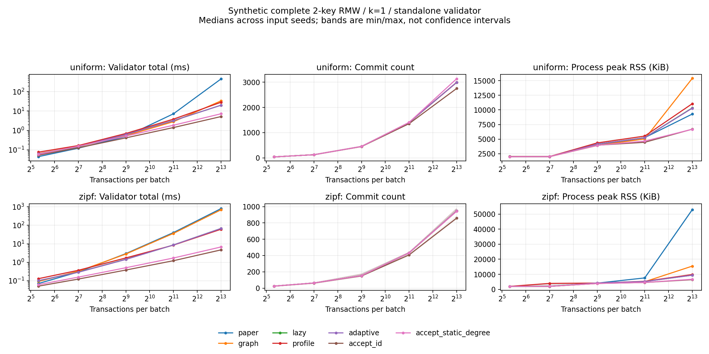

# EAS の適用先再選定と Ding validator の限定実証

対象: [Issue #4](https://github.com/wasanemon/exact_abort_selection/issues/4)
（[保存仕様](docs/issue_4.md)）。調査・測定日: 2026-09-05。
開始点: `codex/issue-3-policy-comparison`、`d150211968ef6d61efda82f9f44f63e3bac28b44`。
測定commit: `4997e9193a38b1ce04b1766e00cc56bd4f7c29e9`。

## 結論と gate

**実システムへの EAS policy 移植は No-Go。Ding Algorithm 2 の忠実な standalone 再現だけを
限定 Go とし、同じ判断を保つ実装比較を完了した。** 実システム採用gateを通る対象を発見した、
または原著DBMSを高速化したとは結論しない。

独立した明示 directed graph＋Algorithm 2 と、既存 EAS graph/lazy/profile/adaptive の
中止round列・commit mask・certificateは全比較で一致した。2キーn=8192ではadaptiveは
paper版より一様22.73倍、Zipf11.67倍速かった。ただし一様ではpaper版の順位管理費用が大きく、
全てをgraph非明示化の効果に帰属できない。同じ既存EAS graphとの比は1.67倍、10.27倍である。

原論文の既定batch sizeに合わせたn=40では、全arity・両分布でpaper版の方がadaptiveより速い。
k=1のmain/scale全34条件で、adaptiveのvalidator時間あたりcommit件数のpaired中央値は
accept_idより低かった。staticには34条件中9条件で同指標が上回るが、条件中央値での
commit件数利得は一つもなく、accept_idを含めた実用優位の証拠にはならない。
大きなgraphの削減価値と、EAS policyの採用価値を分ける必要がある。

開始前に [#3報告](REPORT_policy_comparison_ja.md) と [next_stage.json](next_stage.json) を全文確認した。
#3 の主10条件でcheap policyに対する優位が弱かったことを gate へ反映し、重い本体費用の
仮想感度分析を実測の逆転と扱わなかった。[事前gate](experiments/target_selection/gate.json)の
Policy valueは忠実再現という限定目的に条件付きであり、固有の運用要求は未確認のままである。

## 一次資料・実装監査で分かったこと

候補の10観点、公開sourceのcommit、本文位置、検索query、失敗した取得も
[候補評価表](docs/target_selection_ja.md)と各監査に保存した。

- **Ding**: 本文§4/Algorithm 2が依存辺構築と動的prod-degreeを扱う。原著artifactは
  限定探索で未特定。FabricSharp同梱のFocc-latestは近い第三者実装だが、sum-degreeと先着tieが
  現EASと異なる。[原論文](https://www.vldb.org/pvldb/vol12/p169-ding.pdf)、[対応証明](docs/ding_semantics_ja.md)。
- **Lantern**: arXiv v1の2026-09-03提出と全文を確認。CFBSは既知完全RMW・同じ候補列/順序/交差粒度で
  accept_idと同じ。BPの有向RAW問題をEASの対称graphに置換できない。最終red maskは
  accepted-write unionの漸化式で保存可能という別の導出を示したが、固有artifact未特定で実機追試はない。
  [公式v1全文](https://arxiv.org/html/2609.03315v1)、[CFBS/BP証明・監査](docs/target_audit_lantern_ja.md)。
- **Fabric**: ++はcycle参加数、Sharpはmulti-version reachabilityと到着時判定を使う。
  masterのForkBase閉源依存をsigmod20にもあると誤認しなかった。公開SmallBankの1/2account RMWは
  自然な小集合の証拠だが、主workload全体や同snapshot batchの証拠ではない。
  [原著sourceと本文監査](docs/target_audit_fabric_ja.md)。
- **追加探索**: OptSmartのSTM replay、Fabric-Xのfixed-order validityには実際の保存価値があるが、
  EAS中止policyとは別。SEA 2026 artifactは既にpostingを使い、gas時間simulationである。
  dynamic intersection/heavy-light、implicit Vertex Cover、hypergraph matchingとの広い重複を確認した。
  [一次資料・定理・code位置](docs/target_audit_representation_ja.md)、[同じ部分と違う部分](docs/prior_art_overlap.md)。

## 証明した範囲と測定設計

viableな一バッチ、同snapshot、complete local point-RMW `R_i=W_i=S_i`、固定小arityだけを扱う。
異なる取引は別頂点で、複数共有キーでも一辺、自己辺は除く。
この範囲では `d_in=d_out=d`、prod-degreeはd²、trimは孤立点除去である。
同じID降順tie、frozen top-k、厳密な `remaining<k` 時のk=1 fallbackを与えると、
roundごとの帰納法で全判断が一致する。tie・round内出力順・ID昇順certificateは今回の追加規約。
原論文の不特定なtieの実行履歴そのものを保存したとは言わない。
[完全な対応と境界](docs/ding_semantics_ja.md)。

[実験計画](experiments/target_selection/plan.json)は測定前に固定した。
arity=1/2/3/4、n=40/128/512/2048、一様/Zipf0.99、k=1を主とし、2キー8192を追加。
論文§5で既定k=2を確認できたため、2キーn=40/512/2048を補助にした。
2キー全同一n=1024/4096はstress。宇宙は8,192キーであり、#3の10,000キーとは異なる。
既存generatorを再利用した合成traceで、#3の保存traceや原著SmallBank traceの再測定ではない。

全方式に同じtrace bytesを与え、5seed=11/29/47/71/101、各3反復、方式順seed=202609054。
42条件4,410実行とsmoke10条件1,050実行は全成功。warmupなしの新規processを一つずつ実行した。
同一集合stressは5seedでも同じ競合構造。cheap方式はkに依存しないため、補助k=2側の再測定を
別の品質利得の証拠として合算しない。入力差と時間変動は全観測とseed別CSVに分けて保存した。

Intel Xeon Gold 5418N、g++11.4.0、C++14、`-O3 -DNDEBUG`、Linux5.15、Python3.10.12、
affinity={0}。排他的CPU占有ではない。実行時address-space上限2GiB、各process timeout60秒。
測定binary SHA256: `468d24227a6f77d1a9e273ce847e01c4beea302c2424b5403332d0976088bd7d`。
[環境](experiments/target_selection/results/full/environment.json)・[clean build](experiments/target_selection/results/full/build.json)。

時間はlogical R/Wから正規化・全graph/index構築・選択/trim・decision配列生成・scratch解放まで。
入力parse・検証・JSON serializationは除外する。paperはwriter postingから有向辺を構築し、
毎roundの候補scan＋nth_elementを独立実装した。EAS正規化/selector/oracleを呼ぶ薄いwrapperではない。
paperのselect_msにはtrimを含み、trim_ms=0を無料と解釈しない。内訳分類が違うため全API時間を主比較にする。
RSSは入力parseも含むprocess高水位を検証前に採取し、selector専用memoryとは呼ばない。

以下の単独値は3反復中央値→5seed中央値。倍率・差は同trace/反復で計算してから同じ二段階集計。
別々の中央値の商/差をpaired値に代用しない。validator rateは `commit_count/(total_ms/1000)` であり、
DBMS throughputやretryを含む有効処理率ではない。

## 同じpolicyの時間とmemory

全てk=1、時間はms。倍率はpaper/adaptiveおよびEAS graph/adaptive。

|2キー条件|paper|EAS graph|lazy|profile|adaptive|paper/adaptive|graph/adaptive|
|---|---:|---:|---:|---:|---:|---:|---:|
|40 uniform|0.04475|0.06356|0.06020|0.07630|0.06164|0.729|1.028|
|40 Zipf|0.07116|0.09180|0.10099|0.13004|0.10234|0.713|0.885|
|2048 Zipf|40.52204|36.49184|8.66339|8.47282|8.66466|4.578|4.249|
|8192 uniform|454.68804|33.60000|20.12650|28.44692|20.03773|22.732|1.675|
|8192 Zipf|795.74209|687.69586|67.43166|61.15136|67.35708|11.670|10.271|
|4096 identical|656.99566|1378.89179|831.58439|5.33136|29.74268|22.062|46.376|

main/scale34条件中、adaptiveがpaperより速いpaired中央値は15条件、遅いのは19条件。
EAS graphより速いのは12条件、遅いのは22条件。n=40全8条件でpaperに負けるため、
大batchの速度比を原論文の通常条件へ外挿しない。全反復で一律の勝敗とは記述しない。

8192一様のpaper内訳はbuild6.428ms、selection444.810ms（それぞれ二段階中央値）。
この22.73倍には順位管理実装の差が大きく含まれ、graphを消した効果だけではない。
同じ既存EAS policy実装のgraph/adaptive比1.675倍が、representation比較に近い対照となる。
Zipf8192ではその対照も10.271倍（seed範囲10.057–10.818）で、密な衝突を明示しない効果を支持する。

process RSS中央値は、8192一様でpaper9,288KiB、graph15,392KiB、adaptive10,292KiB。
implicitなら全ての明示実装より省memoryというわけではない。
Zipf8192ではpaper52,912KiB、graph15,440KiB、adaptive9,400KiB。
identical4096ではpaper137,476KiB、graph7,352KiB、adaptive5,744KiB、profile5,676KiB。
このstressではprofileがadaptiveより速く、安いaccept系はさらに速い。
8192両分布のadaptiveは全観測で切替0回のlazy経路で、identical4096は全観測で1回切り替わった。
memory payload見積りとRSSは分けて保存した。

## cheap policy を含めた評価

表のcommitは方式単独の中央値、Δcommitとrate比はadaptive−static / adaptive÷staticのpaired値。

|2キー条件|adaptive commit|static commit|accept_id commit|adaptive ms|static ms|accept_id ms|Δcommit|rate比|
|---|---:|---:|---:|---:|---:|---:|---:|---:|
|40 uniform|39|39|39|0.06164|0.05896|0.05299|0|0.968|
|40 Zipf|25|25|24|0.10234|0.06180|0.05128|0|0.635|
|2048 Zipf|433|433|408|8.66466|1.70507|1.21793|-1|0.196|
|8192 uniform|2993|3137|2751|20.03773|7.27490|5.21840|-144|0.347|
|8192 Zipf|946|943|859|67.35708|6.72286|4.66919|-2|0.101|
|4096 identical|1|1|1|29.74268|1.96434|1.81604|0|0.066|

Zipf8192の単独中央値946−943=+3を、EASのpaired件数利得と読んではいけない。
同seedの差は中央値−2、seed範囲−3〜+3。+3のseedは残るが、その条件全体の利得ではない。
8192一様は−144（−162〜−124）、時間2.749倍、rate0.347倍である。

main/scale34条件全てでadaptive/accept_idのrate中央値は1未満（0.078–0.960）。
170条件×seed中央値でもadaptiveは遅いが、510単独paired反復中3件だけ時間の微小逆転がある
（全て1キーn=40一様の反復2、seed11/47/71）。全反復での一律敗北とはしない。
staticに対しては9条件でrateが上回り、3/4キーの小さい一様batchでは静的初期次数の固定費用が効く。
例えば4キーn=40一様は同件数で2.789倍、3キーn=512一様はpaired1件少ないが1.511倍。
しかしこれらもaccept_idより低いrateであり、安い方式全体への勝利とはしない。
EASがstaticより多くcommitする条件中央値は0/34である。
内訳は26条件で同数、8条件で少ない。一部seedに+1〜+3件が残るのは6条件であり、これも隠さない。

k=2補助の同traceに対するadaptive commit−k=1は90 paired観測で−5〜0件。
fullのzero commitは0だが、別の固定2取引検査ではk=2の0件を正しく保持した。
これはk=1へのfallback条件やfrozen規則を都合よく変更していない証拠である。

帯は5seed内中央値のmin/max、信頼区間ではない。
[全条件表](experiments/target_selection/results/full/summary/tables_ja.md)、
[全観測と内訳](experiments/target_selection/results/full/summary/observations.csv)、
[paired観測](experiments/target_selection/results/full/summary/paired_observations.csv)、
[seed別集計](experiments/target_selection/results/full/summary/paired_seed.csv)に負けと揺らぎを残した。

## 正確性・配布物の検査

- 独立paper実装・全相手intersection/毎round再計算のdirected oracle・既存RMW oracle・EAS4実装を照合。
  全列挙4,681入力、RMW random1,000入力、generic directed random1,000入力、105,258比較、9境界検査成功。
  generic R/Wテストはpaper graphの検査であり、EAS適用範囲の拡張ではない。
- clean ReleaseとASan/UBSanで同じ検査成功（LSanのみ無効）。既存Release CTest3件も成功。
- #3の縮小反例2件、CFBSとの3取引反例、同一キーk=1/2の計5例を35実行で再確認。
  全304取引部分集合を探索し、縮小反例の最大件数4/3も一致。反例の時間は性能比に混ぜない。
- fullの180trace・4,410rawをSHA検査し、630policy/seed組で全配列照合成功。
  うち210組がpaper＋EAS4方式の同policy比較、残り420組がcheap2方式の反復一致。
  smokeも1,050実行と全配列検査成功。timeout/OOM/unsupported/未実行は両系列とも0。
- source corpus70ファイル、143hash照合、#3必読入力2ファイルを指定Git objectと照合。
  集計ツール9テスト（破損/欠測/同mask別round/paired計算/archive検査）成功。
  build/environment/manifestは別のprovenance検証で測定Git8ファイルと照合し、実binaryも一致。
- 配布archiveだけの新directoryからclean-source analyzerで再集計し、full17,820 / smoke4,240 memberを
  照合。両系列の全6CSV・数値facts・Markdown表・PNGが元の集計と完全一致した。
  [archive再現監査](experiments/target_selection/validation/archive_reproduction.json)。

生データはraw_data.tar.gz、完全コマンドとprocess終了状態はruns.jsonl、計画/環境/集計/図は
`experiments/target_selection/results/`、検査は[validation](experiments/target_selection/validation/)に保存した。
[clean checkoutからの再検査・測定手順](README_target_selection.md)を参照。
Issue #3の`next_stage.json`は過去の引継ぎ資料として変更せず、
[Issue #4の引継ぎ](experiments/target_selection/next_stage.json)を別に保存した。

## 最終7問への回答

1. **Ariaの敗因はtarget mismatchだけか。** 両方ある。Aria nativeは元々EAS graphを払わず、
   Dingでは実際にその処理があるという差は確認できた。しかし今回もcheap policyに対する費用対効果は
   不利であり、target変更だけで消える問題ではない。原著DBMS全体での回復は未実証。
2. **exact policy preservationに価値を置くsystemは。** Ding/Focc-latestの既存selector比較、
   Lantern/Fabricの決定性、OptSmart/Fabric-Xのstate/order保存が具体的な接点。
   ただし現EASの最大degree/ID/frozen-k列を固定する固有の運用要求はまだ確認できていない。
3. **自然なfixed-small-access workloadは。** 公開SmallBank/Coinには1/2account RMWがある。
   全batchの同snapshot・complete-RMW率や、原著の混在workloadをそのsubsetが代表することは未確認。
4. **CFBS相当を入れても利点は残るか。** 同じEAS判断を計算する速度/memoryの利点は一部残る。
   policyを自由に選ぶ場合はaccept_idを含めたrateで優位が残らず、EAS採用の根拠は弱い。
5. **改善の本体は何か。** 指定policyを保つ実装・representationの改善。paper比較には
   順位管理の差も入り、全速度比をgraph非明示化だけへ帰属できない。新しい高品質policyの実証ではない。
6. **定理をそのまま使える範囲は。** viable・同snapshot・complete local point-RMW・固定小arity・
   共通tie/frozen規約。一般R/W、range/version、BP層、cycle数、重み付き/arrival priority、retryは別証明が必要。
7. **主要DB/systems会議への最も強い話は。** 「実在するdecision contractを固定したimplicit representation」
   が候補だが、今回のstandaloneと人工traceだけでは弱い。EAS policyの別DBMS移植を成功storyにしない。

対象別No-Go理由と、再開に必要な実装・意味論・自然traceの証拠は [NO_GO.md](NO_GO.md) に残した。
大規模移植、原著systemのend-to-end改善、重い本体/retry性能、新規性認定は行っていない。
変更はIssue #4専用branch/PRにまとめ、既存PRも本PRも自動mergeしない。
